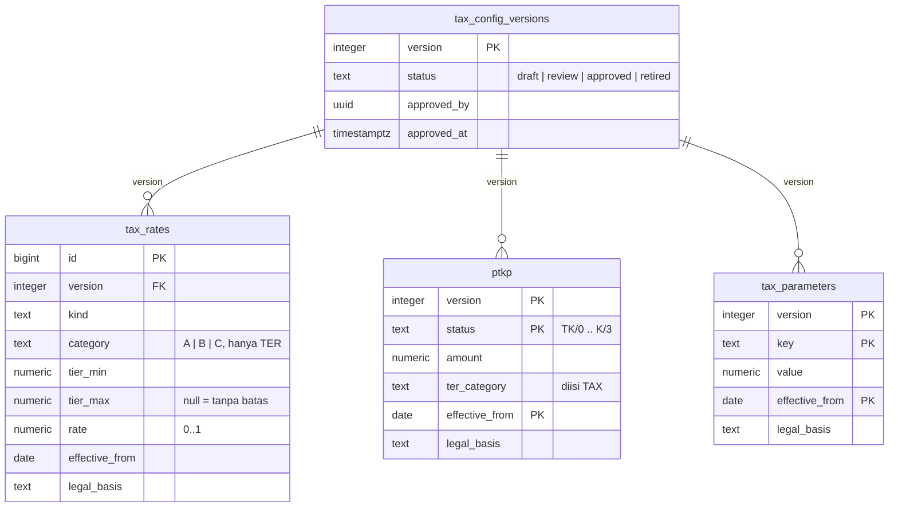

Aplikasi ini sudah dirancang untuk hidup **dengan atau tanpa** backend. Halaman
ini menjelaskan mode sumber data, lingkungan backend, kontrak API REST yang
diharapkan klien, dan draf skema mesin tarif pajak (§7).

Backend yang dipakai sekarang adalah **Supabase** — keputusan D-7 (15 Sep 2026)
memilih BaaS, bukan server buatan sendiri; alasannya di
[log progres](../proyek/log-progres.md). Cara menyiapkannya, skema, dan pemetaan
kontraknya ada di halaman tersendiri: [Supabase](supabase.md).

---

## 1. Empat mode sumber data

Mode dipilih lewat `--dart-define`, tidak pernah dengan menyunting kode.

| Mode | Kapan dipakai | Perilaku |
| --- | --- | --- |
| `mock` | Tanpa backend: kontributor baru, tes, demo | Nol request jaringan. Semua data dari `app/lib/core/data/mock_data.dart`. |
| `hybrid` | Backend REST sedang dibangun bertahap | Coba API dulu; kalau endpoint belum ada atau jaringan mati, jatuh ke data mock. |
| `api` | Backend REST lengkap | Semua dari backend REST. Kegagalan naik ke UI sebagai `ApiException`. |
| `supabase` | Situs publik dan pengembangan lokal | Akun lewat Supabase Auth, data dari Postgres yang dijaga RLS. Kegagalan naik ke UI sebagai `ApiException`. Lihat [Supabase](supabase.md). |

Tanpa `API_BASE_URL` maupun `SUPABASE_URL`, aplikasi otomatis jalan mode `mock`
— jadi `flutter run` polos selalu berhasil. Mode yang konfigurasinya tidak
lengkap (mis. `DATA_SOURCE=api` tanpa URL) juga jatuh ke `mock`, dengan
peringatan di konsol saat mode debug.

Apa pun modenya, tombol "Masuk sebagai pengguna demo" selalu memakai data
contoh tanpa request jaringan.

```bash
# Backend lokal, endpoint belum lengkap
cd app
flutter run -d chrome \
  --dart-define=API_BASE_URL=http://localhost:8080/api/v1 \
  --dart-define=DATA_SOURCE=hybrid \
  --dart-define=ENABLE_API_LOG=true
```

Kalau capek mengetik, salin `app/dart_define.example.json` menjadi
`app/dart_define.json` (sudah di-gitignore) lalu:

```bash
flutter run --dart-define-from-file=dart_define.json
```

Untuk Supabase proyek ini tidak perlu berkas pribadi: setiap lingkungan punya
berkas define yang sudah di-commit (tabel di bawah).

### Lingkungan backend

| Lingkungan | Proyek Supabase | URL | Berkas define | Dipakai untuk |
| --- | --- | --- | --- | --- |
| Produksi | `catatin` | `https://mhoadvaiarjbbzlltqxy.supabase.co` | `app/dart_define.pages.json` | Situs publik <https://piambak.github.io/catatin/> |
| Staging | `catatin-staging` | `https://herafvadqziftszhxqeq.supabase.co` | `app/dart_define.staging.json` | Uji FE/BE sebelum produksi, berisi data contoh kontrak |
| Lokal | stack `supabase start` | `http://127.0.0.1:54321` | buat sendiri, tidak di-commit | Mengembangkan skema dan menjalankan tes pgTAP |

```bash
cd app
flutter run -d chrome --dart-define-from-file=dart_define.staging.json
```

Staging dibuat 15 Sep 2026 sebagai padanan Supabase untuk issue #17 dan #18
([sumber](../sumber/github-issue-17-20-backend-minggu-1.md)), mengikuti
keputusan D-7 ([sumber](../sumber/github-issue-149-d7-stack-backend.md)).
Skema dan riwayat migrasinya identik dengan produksi; login di staging lewat
daftar email, bukan Google. Cara menyiapkan, mengisi data contoh, dan alur uji
FE ada di [Supabase §8](supabase.md#8-staging-dan-data-contoh). Port lokal
`54321` berasal dari `supabase/config.toml`, dan publishable key lokal dicetak
`supabase start` ([sumber](../sumber/supabase-api-keys.md)).

| Define | Default | Arti |
| --- | --- | --- |
| `API_BASE_URL` | *(kosong)* | Root URL backend REST, mis. `https://api.catatin.id/api/v1` |
| `SUPABASE_URL` | *(kosong)* | URL proyek Supabase, mis. `https://<ref>.supabase.co` |
| `SUPABASE_PUBLISHABLE_KEY` | *(kosong)* | Publishable key proyek (`sb_publishable_…`) — publik menurut desain, lihat [Supabase](supabase.md#6-kunci-dan-rahasia) |
| `DATA_SOURCE` | `supabase` bila `SUPABASE_URL` terisi, `hybrid` bila `API_BASE_URL` terisi, selain itu `mock` | `mock` \| `hybrid` \| `api` \| `supabase` |
| `ENABLE_API_LOG` | `false` | Cetak request/response ke konsol |
| `API_CONNECT_TIMEOUT_MS` | `15000` | Timeout koneksi |
| `API_RECEIVE_TIMEOUT_MS` | `15000` | Timeout baca respons |

---

## 2. Di mana kode HTTP-nya

```text
screens/  →  core/services/  →  core/data/  →  api | hybrid | mock | supabase
             (fasad tipis)      (kontrak)
```

Berkas yang disunting saat menyambungkan backend REST:

| Berkas | Isi |
| --- | --- |
| `app/lib/core/data/api_repositories.dart` | **Semua** panggilan HTTP |
| `app/lib/core/constants/app_constants.dart` | Path endpoint (`ApiEndpoints`) |
| `app/lib/core/network/api_client.dart` | Konfigurasi Dio, header auth, refresh token |

Backend Supabase punya pasangannya sendiri — `supabase_repositories.dart` dan
`supabase_client.dart` — yang dijelaskan di [Supabase](supabase.md).

Tidak ada satu pun `Dio` maupun klien Supabase di `screens/` atau `widgets/`.
Kalau kamu merasa perlu memanggil jaringan dari layar, itu tanda kontraknya
yang kurang — tambahkan method di `repositories.dart`.

### Menambah endpoint baru

1. Tambah path di `ApiEndpoints`.
2. Tambah method di kelas abstrak yang sesuai di `core/data/repositories.dart`.
3. Implementasikan di `api_repositories.dart`, `mock_repositories.dart`,
   `hybrid_repositories.dart`, **dan** `supabase_repositories.dart` (analyzer
   akan menolak kalau salah satunya lupa).
4. Teruskan lewat fasad di `core/services/` supaya layar tidak menyentuh
   repository langsung.
5. Tambah bagiannya di dokumen ini.

---

## 3. Kontrak API

Semua path relatif terhadap `API_BASE_URL`. Semua body JSON.

### Autentikasi

Request selain login/register/refresh membawa:

```http
Authorization: Bearer <access_token>
```

Saat server membalas `401`, klien otomatis sekali memanggil `/auth/refresh`
dengan refresh token tersimpan, lalu mengulang request aslinya. Kalau refresh
ikut gagal, sesi lokal dihapus dan pengguna dikembalikan ke layar masuk.

**Umur dan rotasi token** mengikuti default D-14 selama PO belum memutus lain
([log keputusan](../proyek/log-keputusan.md)): access token berlaku
**15 menit**, dan setiap `/auth/refresh` **merotasi** refresh token — yang lama
hangus begitu ditukar. Mode Supabase sudah berperilaku begini; rinciannya,
termasuk deteksi pakai-ulang, di
[Supabase §5](supabase.md#sesi-dan-token-d-14).

#### `POST /auth/register`

```json
{ "name": "Rizal", "email": "rizal@contoh.id", "password": "rahasia123" }
```

Balas `201`. Klien langsung memanggil `/auth/login` setelahnya, jadi respons
register tidak dibaca.

#### `POST /auth/login`

```json
{ "email": "rizal@contoh.id", "password": "rahasia123" }
```

```json
{
  "access_token": "eyJhbGciOi…",
  "refresh_token": "eyJhbGciOi…",
  "user": {
    "id": "usr_01",
    "name": "Rizal",
    "email": "rizal@contoh.id",
    "image": null,
    "created_at": "2026-01-15T08:30:00Z"
  }
}
```

#### `POST /auth/refresh`

```json
{ "refresh_token": "eyJhbGciOi…" }
```

```json
{ "access_token": "eyJhbGciOi…", "refresh_token": "eyJhbGciOi…" }
```

* **Autentikasinya hanya refresh token di body.** Header `Authorization`
  diabaikan dan tidak pernah menggantikan refresh token: request yang hanya
  membawa Bearer — sah atau kedaluwarsa — dibalas `401 unauthorized`. Klien
  karena itu tidak mengirim Bearer ke endpoint ini sama sekali.
* **Respons memuat refresh token baru** (rotasi D-14). Klien wajib menyimpannya
  menggantikan yang lama; yang lama tidak bisa dipakai lagi.
* **Refresh token yang sudah ditukar, dicabut, atau tidak dikenal** dibalas
  `401 unauthorized`. Server boleh memberi jeda pakai-ulang singkat untuk
  request refresh yang datang bersamaan — Supabase memakai 10 detik — tapi
  pakai-ulang di luar jeda itu mencabut seluruh sesi.
* Beberapa request yang kena `401` bersamaan harus berbagi **satu** panggilan
  refresh, bukan masing-masing menukar refresh token yang sama (#34).

Padanan di mode Supabase: `POST /auth/v1/token?grant_type=refresh_token`, yang
membalas galat tadi dengan `400` dan kode `validation_failed` (tanpa refresh
token) atau `refresh_token_not_found`
([Supabase §5](supabase.md#sesi-dan-token-d-14)). Klien Supabase memperbarui
sesi sendiri; refresh token yang dicabut berujung event `signedOut` dan
pengguna kembali ke layar masuk ([Supabase §7](supabase.md#7-sesi-demo-dan-galat)).

#### `GET /auth/me`

```json
{ "user": { "id": "usr_01", "name": "Rizal", "email": "rizal@contoh.id", "image": null, "created_at": "2026-01-15T08:30:00Z" } }
```

---

### Profil usaha

#### `GET /business`

```json
{
  "profiles": [
    {
      "id": "biz_01",
      "user_id": "usr_01",
      "business_name": "Batik Kencana",
      "owner_name": "Rizal",
      "npwp": "12.345.678.9-012.000",
      "business_type": "DAGANG",
      "pkp_status": false,
      "employee_count": 3,
      "is_active": true,
      "created_at": "2026-01-15T08:30:00Z"
    }
  ]
}
```

Daftar kosong berarti pengguna belum menyiapkan profil usaha — klien
mengarahkannya ke layar onboarding.

#### `POST /business` dan `PATCH /business/{id}`

```json
{
  "business_name": "Batik Kencana",
  "owner_name": "Rizal",
  "npwp": "12.345.678.9-012.000",
  "business_type": "DAGANG",
  "pkp_status": false,
  "employee_count": 3
}
```

Balas `{ "profile": { …seperti di atas… } }`.

---

### Transaksi

#### `GET /transactions`

Query, semuanya opsional:

| Parameter | Arti |
| --- | --- |
| `from`, `to` | Rentang tanggal `YYYY-MM-DD`, **inklusif** di kedua ujung. Boleh salah satu saja; ujung yang kosong terbuka. |
| `month`, `year` | Satu bulan atau satu tahun. `month` tanpa `year` berarti bulan itu di tahun berjalan. |
| `business_id` | Hanya transaksi usaha itu |
| `limit` | Paling banyak N transaksi terbaru (kartu transaksi terakhir di dashboard) |

Tanpa filter tanggal, seluruh transaksi dikembalikan — layar Pencatatan
menggulir bulan dan tahun sendiri. Urutannya `date`, lalu `created_at`,
terbaru lebih dulu.

Balas `400 validation_failed` kalau `from`/`to` dicampur dengan `month`/`year`,
`to` sebelum `from`, atau tanggal bukan `YYYY-MM-DD`:

```json
{
  "error": "Filter tanggal tidak valid",
  "code": "validation_failed",
  "details": { "to": "harus sama dengan atau setelah from" }
}
```

Di klien, campuran yang sama ditolak `checkTransactionFilter` di
`repositories.dart` dengan `ArgumentError` sebelum request dikirim — di keempat
mode, jadi kesalahan pemanggil sudah ketahuan saat memakai data contoh. Mode
`api` hanya mengirim parameter yang diisi.

```json
{
  "transactions": [
    {
      "id": "trx_01",
      "business_id": "biz_01",
      "date": "2026-08-05",
      "type": "INCOME",
      "amount": 5200000,
      "category": {
        "id": "ic1",
        "name": "Penjualan Produk",
        "type": "INCOME",
        "tax_relevant": true,
        "is_cogs": false,
        "icon": "🛍️",
        "color": "#059669"
      },
      "description": "Penjualan produk online",
      "payment_method": "QRIS",
      "receipt_note": null,
      "created_at": "2026-08-05T10:12:00Z"
    }
  ]
}
```

* `type`: `INCOME` | `EXPENSE`
* `amount`: rupiah penuh, bukan sen
* `date`: `YYYY-MM-DD`
* `payment_method`: `CASH` | `TRANSFER` | `QRIS` | `KARTU_DEBIT` | `KARTU_KREDIT` | `COD` | `OTHER`
* `category` disematkan penuh (bukan sekadar id) supaya daftar transaksi bisa
  dirender tanpa request kedua.
* `recurring_template_id`: id [transaksi berulang](#transaksi-berulang) yang
  menerbitkannya, atau `null` untuk transaksi yang dicatat manual. Klien lama
  boleh mengabaikannya. *(Kontrak Minggu 3, #60.)*

#### `GET /transactions/{id}` → `{ "transaction": { … } }`

#### `POST /transactions`

```json
{
  "business_id": "biz_01",
  "date": "2026-08-05",
  "type": "INCOME",
  "amount": 5200000,
  "category_id": "ic1",
  "description": "Penjualan produk online",
  "payment_method": "QRIS",
  "receipt_note": null
}
```

Balas `201`. Isi respons tidak dibaca klien.

Aturan validasi yang sama berlaku untuk `POST` dan `PATCH`. Server membalas
`400 validation_failed` dengan `details` berisi **satu** field yang salah:

| Field | Aturan | Contoh `details` |
| --- | --- | --- |
| `amount` | Lebih dari 0 | `{ "amount": "Nominal harus lebih dari 0." }` |
| `date` | `YYYY-MM-DD` yang ada di kalender, 2000-01-01 s.d. 2099-12-31 | `{ "date": "Tanggal harus antara 1 Januari 2000 dan 31 Desember 2099." }` |
| `category_id` | Kategori ada | `{ "category_id": "Kategori tidak ditemukan." }` |
| `category_id` | Kategori sejenis dengan `type` — kategori pemasukan hanya untuk `INCOME`, pengeluaran hanya untuk `EXPENSE` | `{ "category_id": "Kategori tidak cocok dengan jenis transaksi." }` |
| `type` | `INCOME` \| `EXPENSE` | `{ "type": "Jenis transaksi harus pemasukan atau pengeluaran." }` |
| `payment_method` | Salah satu dari tujuh nilai di atas | `{ "payment_method": "Metode pembayaran tidak dikenal." }` |

Di mode Supabase aturan ini dijaga constraint database, dan pesan per field
yang sama dibentuk klien dari nama constraint-nya
([Supabase §3](supabase.md#3-skema)).

#### `PATCH /transactions/{id}`

Mengganti isi transaksi. Body **lengkap**, sama dengan `POST /transactions` —
bukan patch per field: klien selalu mengirim seluruh isi lembar edit.
`business_id` diabaikan server, jadi transaksi tidak pindah usaha.

Balas `200` dengan `{ "transaction": { … } }` berbentuk item `GET /transactions`;
klien tidak membaca isinya.

| Status | Kapan |
| --- | --- |
| `400 validation_failed` | Melanggar aturan validasi di `POST /transactions` di atas: nominal ≤ 0, tanggal tidak valid atau di luar 2000–2099, `type` atau `payment_method` di luar daftar, kategori tidak ada, atau kategori tidak sejenis dengan `type` |
| `401 unauthorized` | Sesi habis |
| `404 not_found` | Transaksi tidak ada **atau milik akun lain** — sengaja tidak dibedakan |

Dipakai lembar "Edit transaksi" lewat `AccountingService.updateTransaction`.
Keempat mode mengimplementasikannya sejak 13 Sep 2026
([log progres](../proyek/log-progres.md)); di Supabase, update yang tidak
mengenai baris apa pun — termasuk karena disaring RLS — menjadi 404
([Supabase §3](supabase.md#3-skema)).

#### `DELETE /transactions/{id}` → `204`

#### `GET /transactions/aggregate?year=2026`

Pemasukan, pengeluaran, HPP, jumlah transaksi, dan omzet berjalan per bulan
untuk satu tahun — bahan Simulator dan ringkasan tutup bulan. `year` wajib.

```json
{
  "year": 2026,
  "months": [
    { "month": 1, "income": 19200000, "expense": 16300000, "cogs": 5800000, "tx_count": 6, "ytd_omzet": 19200000 },
    { "month": 2, "income": 21500000, "expense": 17000000, "cogs": 6500000, "tx_count": 6, "ytd_omzet": 40700000 },
    { "month": 3, "income": 38000000, "expense": 21900000, "cogs": 11400000, "tx_count": 6, "ytd_omzet": 78700000 },
    …
    { "month": 8, "income": 28500000, "expense": 18200000, "cogs": 6200000, "tx_count": 12, "ytd_omzet": 285000000 },
    …
    { "month": 12, "income": 0, "expense": 0, "cogs": 0, "tx_count": 0, "ytd_omzet": 300400000 }
  ]
}
```

* `months` selalu 12 item, Januari lebih dulu; bulan tanpa transaksi bernilai nol.
* `cogs` adalah bagian `expense` dari kategori ber-`is_cogs`.
* `ytd_omzet` adalah jumlah `income` Januari sampai bulan itu. Angka Agustus di
  atas sama dengan `ytd_omzet` contoh `GET /dashboard/summary` bulan yang sama.
* Laba tidak dikirim; klien menghitung `income − expense` (`MonthAggregate.profit`).
* Balas `400 validation_failed` kalau `year` kosong atau bukan angka.
* **Urutan rute:** server harus mencocokkan `/transactions/aggregate` sebelum
  `/transactions/{id}`, kalau tidak `aggregate` terbaca sebagai id.

Di klien: `TransactionRepository.getAggregate(year:)` → `YearAggregate`, lewat
`AccountingService.getAggregate`. Omzet YTD dijumlahkan di satu fungsi,
`monthAggregates()` di `models/dashboard_model.dart`, yang juga dipakai
ringkasan dashboard dan grafik KPI mode Supabase — supaya aturannya tidak
bercabang seperti T-13 ([backlog teknis](../proyek/backlog-teknis.md)). Di
Supabase angkanya dari fungsi `monthly_totals` yang sama dengan ringkasan
dashboard, tanpa migrasi baru ([Supabase §4](supabase.md#4-pemetaan-kontrak)).
Contoh di atas adalah data contoh staging ([Supabase §8](supabase.md#8-staging-dan-data-contoh)).

#### `GET /tx-categories`

```json
{
  "categories": [
    { "id": "ic1", "name": "Penjualan Produk", "type": "INCOME", "tax_relevant": true, "is_cogs": false, "icon": "🛍️", "color": "#059669" }
  ]
}
```

`color` wajib hex `#RRGGBB`; `icon` satu emoji.

---

### Transaksi berulang

> **Status: kontrak untuk sinkronisasi Rabu Minggu 3 (#60), belum
> diimplementasikan.** Implementasinya #58. Ubah bagian ini dulu kalau FE butuh
> bentuk lain — bukan kodenya.

Template yang menerbitkan transaksi biasa secara otomatis, mis. sewa kios tiap
bulan atau gaji tiap minggu. Transaksi hasil terbitan adalah transaksi biasa:
muncul di `GET /transactions`, ikut agregat, dan bisa diubah atau dihapus satu
per satu tanpa menyentuh templatenya.

```json
{
  "id": "rec_01",
  "business_id": "biz_01",
  "type": "EXPENSE",
  "amount": 1500000,
  "category": { "id": "ec4", "name": "Sewa Tempat", "type": "EXPENSE", "tax_relevant": true, "is_cogs": false, "icon": "🏠", "color": "#F59E0B" },
  "description": "Sewa kios",
  "payment_method": "TRANSFER",
  "frequency": "MONTHLY",
  "start_date": "2026-01-01",
  "end_date": null,
  "next_date": "2026-10-01",
  "is_active": true,
  "created_at": "2026-09-21T10:00:00Z"
}
```

| Field | Arti |
| --- | --- |
| `frequency` | `WEEKLY` \| `MONTHLY` |
| `start_date` | Jangkar jadwal. Bulanan: tanggal yang sama tiap bulan; kalau bulan itu lebih pendek, tanggal terakhirnya (31 Jan → 28 Feb → 31 Mar). Mingguan: hari yang sama tiap 7 hari. |
| `end_date` | Opsional, **inklusif**. Kemunculan setelah tanggal ini tidak diterbitkan. |
| `next_date` | Kemunculan berikutnya yang akan diterbitkan. `null` kalau template sudah selesai atau dihentikan. |
| `is_active` | `false` setelah dihentikan atau setelah melewati `end_date`. Template nonaktif tidak bisa dinyalakan lagi — buat template baru. |

**Aturan penerbitan.**

* Server menerbitkan setiap kemunculan yang jatuh tempo **sekali sehari**,
  tidak lama setelah pukul 00.00 WIB. Tanggal transaksinya = tanggal kemunculan,
  bukan tanggal penerbitan.
* **Tidak ada pengisian mundur.** Kemunculan sebelum template dibuat tidak
  pernah diterbitkan; `start_date` di masa lalu hanya menentukan jangkar
  jadwal. Kemunculan yang jatuh **hari ini** saat template dibuat langsung
  diterbitkan, tidak menunggu besok.
* Kalau penerbitan harian sempat terlewat (mis. server berhenti), semua
  kemunculan yang tertinggal sejak itu diterbitkan pada penerbitan berikutnya.
* Satu kemunculan tidak pernah diterbitkan dua kali, walau penerbitan diulang.

#### `GET /recurring`

`{ "templates": [ … ] }` — yang aktif lebih dulu, lalu menurut `next_date`.

#### `POST /recurring`

```json
{
  "type": "EXPENSE",
  "amount": 1500000,
  "category_id": "ec4",
  "description": "Sewa kios",
  "payment_method": "TRANSFER",
  "frequency": "MONTHLY",
  "start_date": "2026-01-01",
  "end_date": null
}
```

Balas `201` dengan `{ "template": { … } }`. `business_id` diambil server dari
profil usaha pengguna; tanpa profil usaha balas `409 business_profile_required`.

#### `PATCH /recurring/{id}`

Body lengkap, sama dengan `POST`. Balas `200` dengan `{ "template": { … } }`.
Perubahan hanya berlaku untuk kemunculan **berikutnya**; transaksi yang sudah
terbit tidak ikut berubah. Kalau `frequency` atau `start_date` berubah,
`next_date` dihitung ulang: kemunculan pertama jadwal baru yang jatuh hari ini
atau sesudahnya. Template nonaktif balas `409 conflict`.

#### `POST /recurring/{id}/stop`

Menghentikan pengulangan: `is_active` jadi `false`, `next_date` jadi `null`.
Balas `200` dengan `{ "template": { … } }`. Transaksi yang sudah terbit tetap
ada. Menghentikan template yang sudah nonaktif tidak mengubah apa pun.

**Galat** untuk `POST` dan `PATCH`: aturan validasi sama dengan
[`POST /transactions`](#post-transactions) — nominal, kategori yang sejenis,
`type`, `payment_method` — ditambah `frequency` di luar daftar, `start_date` di
luar 2000–2099, atau `end_date` sebelum `start_date`, semuanya
`400 validation_failed` dengan satu field di `details`. Template milik akun
lain atau yang tidak ada balas `404 not_found`.

---

### Lampiran struk

> **Status: kontrak untuk sinkronisasi Rabu Minggu 3 (#60), belum
> diimplementasikan.** Implementasinya #59.

Foto struk yang menempel ke satu transaksi. Satu transaksi boleh punya lebih
dari satu lampiran.

```json
{
  "id": "att_01",
  "transaction_id": "trx_01",
  "file_name": "struk-sewa.jpg",
  "mime_type": "image/jpeg",
  "size_bytes": 482113,
  "url": "https://…/struk-sewa.jpg?token=…",
  "url_expires_at": "2026-09-21T11:00:00Z",
  "created_at": "2026-09-21T10:00:00Z"
}
```

* `url` adalah **signed URL** yang berlaku **1 jam** (`url_expires_at`). Jangan
  simpan URL-nya; minta ulang lewat `GET` saat dibutuhkan. Berkasnya tidak
  pernah bisa dibuka tanpa URL bertanda tangan.
* Tipe yang diterima: `image/jpeg`, `image/png`, `image/webp`. Ukuran paling
  besar **5 MB** (5.242.880 byte). Klien sebaiknya mengecilkan foto kamera
  sebelum mengunggah.

#### `GET /transactions/{id}/attachments`

`{ "attachments": [ … ] }`, yang terlama lebih dulu. Transaksi yang tidak ada
atau milik akun lain balas `404 not_found`.

#### `POST /transactions/{id}/attachments`

`multipart/form-data` dengan satu bagian `file`. Balas `201` dengan
`{ "attachment": { … } }`.

| Status | Kapan |
| --- | --- |
| `400 validation_failed` | `details.file`: berkas lebih dari 5 MB, kosong, atau bukan JPEG/PNG/WebP |
| `404 not_found` | Transaksi tidak ada atau milik akun lain |

#### `DELETE /transactions/{id}/attachments/{attachmentId}` → `204`

Menghapus lampiran beserta berkasnya. Menghapus transaksi (`DELETE
/transactions/{id}`) ikut menghapus semua lampirannya.

---

### Dashboard

#### `GET /dashboard/summary?month=8&year=2026`

```json
{
  "monthly_income": 28500000,
  "monthly_expense": 18200000,
  "monthly_profit": 10300000,
  "ytd_omzet": 285000000,
  "tx_count": 12
}
```

Persentase ambang PKP dihitung di klien (`ytd_omzet / 4.800.000.000`), jadi
backend tidak perlu mengirimkannya.

#### `GET /dashboard/close?month=8&year=2026`

> **Status: sudah dipakai mode `supabase`, `mock`, dan `hybrid` (#74).** Server
> REST cukup mengikuti bentuk di bawah — klien `api` sudah memanggilnya.

Ringkasan tutup bulan — angka satu bulan yang siap dipakai kartu ringkasan
dashboard dan Simulator. `month` dan `year` wajib.

```json
{
  "month": 8,
  "year": 2026,
  "income": 28500000,
  "expense": 18200000,
  "profit": 10300000,
  "cogs": 6200000,
  "tx_count": 12,
  "ytd_omzet": 285000000
}
```

* `profit` = `income − expense`; `cogs` adalah bagian `expense` dari kategori
  ber-`is_cogs`; `ytd_omzet` = pemasukan Januari sampai bulan itu. Semua angka
  dari sumber yang sama dengan
  [`GET /transactions/aggregate`](#get-transactionsaggregateyear2026), jadi
  bulan yang sama selalu memberi angka yang sama.
* Bulan tanpa transaksi bernilai nol, bukan `404`.
* Balas `400 validation_failed` kalau `month` bukan 1–12 atau `year` kosong.
  Klien sudah menolak `month` di luar 1–12 sebelum mengirim permintaan
  (`checkMonthClose`), dengan pesan di `details.month`.

Contoh di atas adalah bulan Agustus data contoh staging, sama dengan contoh
`GET /dashboard/summary` dan `GET /transactions/aggregate`.

#### `GET /dashboard/kpi-history?metric=income`

`metric`: `income` | `expense` | `profit` | `ytd`.

```json
{ "points": [ { "month": "Jan", "value": 19200000 }, { "month": "Feb", "value": 21500000 } ] }
```

`month` adalah label pendek Bahasa Indonesia yang langsung dipakai sebagai
label sumbu X.

#### `GET /tax-calendar?limit=3`

```json
{
  "deadlines": [
    { "id": "dl_01", "label": "PPh Final Masa Oktober", "tax_type": "PPH_FINAL", "deadline": "2026-11-15T00:00:00Z", "status": "PENDING" }
  ]
}
```

`tax_type`: `PPH_FINAL` | `PPH21` | `SPT` | `PPN`. `status`: `PENDING` | `PAID` | `LATE`.

---

### Bentuk error

Semua status non-2xx dari semua endpoint — termasuk yang baru — memakai bentuk
yang sama:

```json
{
  "error": "Email sudah terdaftar",
  "code": "conflict",
  "details": { "email": "sudah dipakai akun lain" }
}
```

| Field | Wajib | Isi |
| --- | --- | --- |
| `error` | Ya | Pesan Bahasa Indonesia yang aman ditampilkan. `message` masih diterima klien sebagai alias, tapi server mengirim `error`. |
| `code` | Ya | Kode mesin `snake_case` yang stabil. Klien bercabang berdasarkan `code` atau status, tidak pernah berdasarkan teks `error`. |
| `details` | Tidak | Objek `field → pesan`. Kirim hanya kalau ada isinya; objek kosong atau yang bukan objek dibuang klien. |

Kode dasar per status, dan pesan yang ditampilkan `ApiException.userMessage`:

| Status | `code` | Ditampilkan ke pengguna |
| --- | --- | --- |
| 400 | `validation_failed` | isi `details` pertama, atau "Data tidak valid." |
| 401 | `unauthorized` | "Sesi Anda telah berakhir. Silakan masuk kembali." |
| 403 | `forbidden` | "Anda tidak memiliki akses ke fitur ini." |
| 404 | `not_found` | "Data tidak ditemukan." |
| 409 | `conflict` | isi `error` apa adanya |
| 422 | `unprocessable` | "Data yang dikirim tidak valid." |
| 429 | `rate_limited` | "Terlalu banyak percobaan. Tunggu sebentar, lalu coba lagi." |
| 500 | `internal` | "Terjadi kesalahan server. Coba lagi nanti." |
| gagal jaringan | — | "Terjadi kesalahan. Periksa koneksi internet Anda." |

Endpoint boleh memakai kode yang lebih spesifik untuk status yang sama bila klien
perlu membedakannya — mis. `409 business_profile_required` saat mencatat
transaksi sebelum profil usaha ada. Kode baru dicatat di tabel ini lebih dulu.

Body galat diurai `apiExceptionFromResponse()` di
`app/lib/core/network/api_client.dart`, jadi `ApiException.code` terisi di mode
`api` dan `hybrid`. Mode `supabase` tidak punya body REST: galat Supabase
diterjemahkan ke status yang sama di `supabase_client.dart` dengan `code`
kosong — bercabanglah pada `statusCode` kalau kodenya harus jalan di semua mode.
Pelanggaran constraint yang dikenal tetap membawa pesan per field di
`ApiException.errors`, sama dengan `details` di mode REST (#40).
Bentuk ini dijaga tes `app/test/kontrak_transaksi_test.dart` dan
`app/test/supabase_mapping_test.dart`.

---

## 4. Yang **tidak** butuh backend

* **Simulator pajak** (`core/services/simulator_service.dart`) — murni hitungan
  lokal berdasarkan PP 23/2018 dan PMK 168/2023. Tarif dan tabel TER ada di
  `AppConstants`.
* **Preferensi tema** — lokal.

---

## 5. CORS (khusus web)

Bagian ini berlaku untuk backend REST buatan sendiri. Pengaturan origin untuk
Supabase ada di [Supabase](supabase.md#5-pengaturan-auth).

Situs tayang dari `https://piambak.github.io`, jadi backend harus mengizinkan
origin itu:

```http
Access-Control-Allow-Origin: https://piambak.github.io
Access-Control-Allow-Headers: Authorization, Content-Type
Access-Control-Allow-Methods: GET, POST, PATCH, DELETE, OPTIONS
```

Tambahkan `http://localhost:*` untuk pengembangan. Tanpa ini aplikasi web akan
gagal total meski backend sehat — dan pesannya di konsol peramban, bukan di UI.

## 6. Menyalakan backend di situs publik

Build situs publik membaca `app/dart_define.pages.json`. Berkas yang sama
dipakai `.github/workflows/publish-web.yml`, `ci.yml`, dan `tool/build_web.*`
tanpa argumen, dan di-commit — bukan disimpan di repo Variables.

* **Supabase** — isi `SUPABASE_URL` dan `SUPABASE_PUBLISHABLE_KEY`. Sejak
  13 Sep 2026 keduanya terisi proyek `catatin`, jadi situs publik memakai
  database asli. Kalau salah satunya dikosongkan, situs kembali tayang dengan
  data contoh. Kenapa kedua nilai itu boleh di-commit dijelaskan di
  [Supabase](supabase.md#6-kunci-dan-rahasia).
* **REST** — ganti isinya jadi `API_BASE_URL` dan `DATA_SOURCE=api`. URL
  backend ikut ter-compile ke bundel JS publik, jadi memang bukan rahasia.

Jangan pernah menaruh kunci yang memberi akses melebihi klien publik — secret
key, token admin, password database — di `--dart-define` atau berkas define:
apa pun yang masuk build web bisa dibaca siapa saja.

---

## 7. Skema mesin tarif pajak (draf untuk review TAX)

> **Status: draf, belum menjadi migrasi.** Ditulis untuk issue #20 dan menunggu
> review pakar pajak di #45 — apakah semua isi spesifikasi bisa
> direpresentasikan; setelah itu tabelnya menjadi migrasi di #42
> ([sumber](../sumber/github-issue-17-20-backend-minggu-1.md)). **Halaman ini
> tidak memuat satu pun angka tarif.** Angka resmi datang dari spesifikasi
> pajak milik TAX, bukan dari backend — aturan yang sama dengan
> [Aturan pajak](../domain/aturan-pajak.md).

### 7.1 Kenapa berbasis konfigurasi

Tarif PPh Final, lapisan TER, PTKP, dan ambang PKP sekarang berupa konstanta di
`app/lib/core/constants/app_constants.dart`
([Aturan pajak](../domain/aturan-pajak.md)), jadi mengubah satu angka berarti
merilis aplikasi baru. Linimasa Minggu 1 meminta skema yang membuat pakar pajak
bisa memperbarui angka tanpa rilis ([linimasa](../proyek/linimasa.md)), dan D-7
memetakan kebutuhan itu ke tabel Postgres berversi dengan peran admin di RLS
([sumber](../sumber/github-issue-149-d7-stack-backend.md)).

### 7.2 Model



| Tabel | Satu baris adalah | Dari issue #20 |
| --- | --- | --- |
| `tax_config_versions` | Satu paket angka yang direview dan disetujui TAX bersama-sama | Tambahan: pemilik status dan persetujuan versi |
| `tax_rates` | Satu lapisan tarif satu jenis pajak | `version, effective_from, kind, tier_min, tier_max, rate, category` + `legal_basis` |
| `ptkp` | PTKP satu status | `status, amount, version` + `effective_from`, `ter_category`, `legal_basis` |
| `tax_parameters` | Satu angka tunggal: ambang, batas, persentase | **Usulan tambahan** — lihat pertanyaan TAX |

`tax_parameters` diusulkan karena beberapa angka konfigurasi bukan tarif
berlapis, mis. ambang PKP yang sekarang `AppConstants.pkpThreshold`, pengecualian
omzet PPh Final (T-3), atau biaya jabatan dengan batas atas (T-4)
([backlog teknis](../proyek/backlog-teknis.md)). Nama kunci seperti
`AMBANG_PKP_OMZET` hanya contoh bentuk; daftar kuncinya diputuskan bersama TAX.

### 7.3 Aturan

**Versi.** Status berjalan `draft → review → approved → retired`. Paling banyak
satu versi `approved` pada satu waktu (unique index parsial). Baris milik versi
`approved` atau `retired` tidak bisa ditambah, diubah, atau dihapus — trigger
menolaknya dengan galat `55000` — jadi perubahan angka selalu berarti versi
baru. Versi `approved` hanya boleh berpindah ke `retired`. Mengganti versi yang
berlaku: `retired`-kan yang lama, lalu `approved`-kan yang baru dalam satu
transaksi. Hasil hitung dan skenario tersimpan mencatat nomor versinya.

**`effective_from`.** Tanggal aturan mulai berlaku. Satu versi boleh memuat
aturan lama dan baru sekaligus, mis. tarif yang berganti di tengah tahun. Untuk
tanggal hitung D, mesin memakai baris dengan `effective_from` terbesar yang
≤ D untuk `kind` dan `category` yang sama (§7.5).

**Lapisan `(tier_min, tier_max]`.** Batas bawah eksklusif, batas atas
inklusif, `tier_max` kosong berarti tanpa batas atas — notasi range PostgreSQL
([sumber](../sumber/postgres-range-exclusion.md)). Arah inklusifnya sama dengan
cara hitung sekarang: `calculatePPh21()` mengambil lapisan pertama yang
`gaji kotor ≤ max` ([Aturan pajak](../domain/aturan-pajak.md)). Jumlah ≤ 0 tidak
masuk lapisan mana pun; mesin mengembalikan pajak nol.

**Lapisan tidak boleh tumpang tindih** untuk versi, `kind`, `category`, dan
`effective_from` yang sama. Dijaga exclusion constraint GiST: `btree_gist`
membuat kolom biasa bisa dibandingkan `=` di samping `&&` untuk range
([sumber](../sumber/postgres-range-exclusion.md)). Kategori TER yang berbeda
boleh memakai rentang yang sama.

| `kind` | Cara dipakai mesin | `category` | Status |
| --- | --- | --- | --- |
| `PPH_FINAL_UMKM` | Tarif × omzet, satu lapisan | Kosong | Dipakai sekarang — PP 23/2018 |
| `PPH21_TER` | Gaji kotor × tarif lapisan yang cocok | `A`, `B`, atau `C`, wajib | Dipakai sekarang — PMK 168/2023; tabel B dan C belum ada (T-1) |
| `PPH_PASAL_17` | Progresif per lapisan | Kosong | Kandidat — menunggu keputusan rekalkulasi Desember (T-4) |
| `PPN` | Tarif × dasar pengenaan | Kosong | Kandidat — menunggu keputusan lingkup PPN (D-8) |

**`legal_basis`** wajib di setiap baris, karena hasil mesin tarif kelak memuat
`legal_basis` dan `config_version` (#88), dan sign-off pajak dicatat per versi
konfigurasi (#131) ([sumber](../sumber/github-issue-17-20-backend-minggu-1.md)).

**Hak akses.**

* `authenticated` membaca versi `approved` dan `retired` beserta barisnya. Versi
  `draft` dan `review` hanya terlihat TAX.
* Menulis ke keempat tabel hanya untuk akun ber-`app_metadata.role = 'tax_admin'`,
  dibaca lewat `auth.jwt()`. Dipilih `app_metadata` karena pengguna tidak bisa
  mengubahnya sendiri, sedangkan `user_metadata` bisa
  ([sumber](../sumber/supabase-rls-auth-jwt.md)). Peran dipasang BE di kolom
  `raw_app_meta_data` lewat SQL editor, dan baru terbaca setelah token pengguna
  itu diperbarui ([sumber](../sumber/supabase-rls-auth-jwt.md)).
* `anon` tidak mendapat hak apa pun, sama dengan tabel lain
  ([Supabase §3](supabase.md#3-skema)). Trigger tetap berjalan untuk TAX:
  pembuat versi pun tidak bisa mengubah versi yang sudah dikunci.

### 7.4 DDL

```sql
create extension if not exists btree_gist with schema extensions;

-- ── Versi konfigurasi ──

create table public.tax_config_versions (
  version     integer primary key,
  status      text not null default 'draft'
              check (status in ('draft', 'review', 'approved', 'retired')),
  notes       text,
  approved_by uuid references auth.users (id),
  approved_at timestamptz,
  created_at  timestamptz not null default now(),
  constraint tax_config_versions_approval_check
    check ((status in ('approved', 'retired')) = (approved_at is not null))
);

create unique index tax_config_versions_one_approved
  on public.tax_config_versions ((true))
  where status = 'approved';

-- ── Tarif berlapis: (tier_min, tier_max], tier_max null = tanpa batas ──

create table public.tax_rates (
  id             bigint generated always as identity primary key,
  version        integer not null references public.tax_config_versions (version),
  kind           text not null
                 check (kind in ('PPH_FINAL_UMKM', 'PPH21_TER', 'PPH_PASAL_17', 'PPN')),
  category       text check (category in ('A', 'B', 'C')),
  tier_min       numeric(18, 2) not null default 0 check (tier_min >= 0),
  tier_max       numeric(18, 2),
  rate           numeric(7, 6) not null check (rate between 0 and 1),
  effective_from date not null,
  legal_basis    text not null check (length(trim(legal_basis)) > 0),
  constraint tax_rates_tier_check
    check (tier_max is null or tier_max > tier_min),
  constraint tax_rates_category_kind_check
    check ((kind = 'PPH21_TER') = (category is not null)),
  constraint tax_rates_no_overlap exclude using gist (
    version with =,
    kind with =,
    (coalesce(category, '-')) with =,
    effective_from with =,
    numrange(tier_min, tier_max, '(]') with &&
  )
);

-- ── PTKP ──

create table public.ptkp (
  version        integer not null references public.tax_config_versions (version),
  status         text not null
                 check (status in ('TK/0', 'TK/1', 'TK/2', 'TK/3', 'K/0', 'K/1', 'K/2', 'K/3')),
  amount         numeric(18, 2) not null check (amount >= 0),
  ter_category   text check (ter_category in ('A', 'B', 'C')),
  effective_from date not null,
  legal_basis    text not null check (length(trim(legal_basis)) > 0),
  primary key (version, status, effective_from)
);

-- ── Parameter tunggal (usulan tambahan) ──

create table public.tax_parameters (
  version        integer not null references public.tax_config_versions (version),
  key            text not null check (key ~ '^[A-Z][A-Z0-9_]*$'),
  value          numeric(18, 6) not null,
  effective_from date not null,
  legal_basis    text not null check (length(trim(legal_basis)) > 0),
  notes          text,
  primary key (version, key, effective_from)
);

-- ── Versi approved/retired terkunci ──

create function public.tax_config_row_guard()
returns trigger
language plpgsql
set search_path = ''
as $$
begin
  if tg_op in ('UPDATE', 'DELETE') then
    if exists (select 1 from public.tax_config_versions v
                where v.version = old.version and v.status in ('approved', 'retired')) then
      raise exception 'Konfigurasi pajak versi % sudah dikunci; buat versi baru.', old.version
        using errcode = '55000';
    end if;
  end if;
  if tg_op in ('INSERT', 'UPDATE') then
    if exists (select 1 from public.tax_config_versions v
                where v.version = new.version and v.status in ('approved', 'retired')) then
      raise exception 'Konfigurasi pajak versi % sudah dikunci; buat versi baru.', new.version
        using errcode = '55000';
    end if;
    return new;
  end if;
  return old;
end;
$$;

create trigger tax_rates_guard before insert or update or delete on public.tax_rates
  for each row execute function public.tax_config_row_guard();
create trigger ptkp_guard before insert or update or delete on public.ptkp
  for each row execute function public.tax_config_row_guard();
create trigger tax_parameters_guard before insert or update or delete on public.tax_parameters
  for each row execute function public.tax_config_row_guard();

-- approved hanya boleh ke retired; retired final.
create function public.tax_config_version_guard()
returns trigger
language plpgsql
set search_path = ''
as $$
begin
  if old.status in ('approved', 'retired') then
    if tg_op = 'DELETE'
       or old.status = 'retired'
       or new.status <> 'retired'
       or new.version <> old.version then
      raise exception 'Versi % berstatus %: hanya approved -> retired yang diizinkan.',
        old.version, old.status
        using errcode = '55000';
    end if;
  end if;
  if tg_op = 'DELETE' then
    return old;
  end if;
  return new;
end;
$$;

create trigger tax_config_versions_guard before update or delete on public.tax_config_versions
  for each row execute function public.tax_config_version_guard();

-- ── Hak akses & RLS ──

alter table public.tax_config_versions enable row level security;
alter table public.tax_rates           enable row level security;
alter table public.ptkp                enable row level security;
alter table public.tax_parameters      enable row level security;

revoke all on table
  public.tax_config_versions, public.tax_rates, public.ptkp, public.tax_parameters
  from anon, authenticated;
grant select, insert, update, delete on table
  public.tax_config_versions, public.tax_rates, public.ptkp, public.tax_parameters
  to authenticated;
revoke execute on function
  public.tax_config_row_guard(), public.tax_config_version_guard()
  from public, anon, authenticated;

create policy "Versi pajak terbit bisa dibaca"
  on public.tax_config_versions for select to authenticated
  using (status in ('approved', 'retired'));
create policy "TAX mengelola versi pajak"
  on public.tax_config_versions for all to authenticated
  using (((select auth.jwt()) -> 'app_metadata' ->> 'role') = 'tax_admin')
  with check (((select auth.jwt()) -> 'app_metadata' ->> 'role') = 'tax_admin');

create policy "Tarif versi terbit bisa dibaca"
  on public.tax_rates for select to authenticated
  using (exists (select 1 from public.tax_config_versions v
                  where v.version = tax_rates.version
                    and v.status in ('approved', 'retired')));
create policy "TAX mengelola tarif"
  on public.tax_rates for all to authenticated
  using (((select auth.jwt()) -> 'app_metadata' ->> 'role') = 'tax_admin')
  with check (((select auth.jwt()) -> 'app_metadata' ->> 'role') = 'tax_admin');

create policy "PTKP versi terbit bisa dibaca"
  on public.ptkp for select to authenticated
  using (exists (select 1 from public.tax_config_versions v
                  where v.version = ptkp.version
                    and v.status in ('approved', 'retired')));
create policy "TAX mengelola PTKP"
  on public.ptkp for all to authenticated
  using (((select auth.jwt()) -> 'app_metadata' ->> 'role') = 'tax_admin')
  with check (((select auth.jwt()) -> 'app_metadata' ->> 'role') = 'tax_admin');

create policy "Parameter versi terbit bisa dibaca"
  on public.tax_parameters for select to authenticated
  using (exists (select 1 from public.tax_config_versions v
                  where v.version = tax_parameters.version
                    and v.status in ('approved', 'retired')));
create policy "TAX mengelola parameter"
  on public.tax_parameters for all to authenticated
  using (((select auth.jwt()) -> 'app_metadata' ->> 'role') = 'tax_admin')
  with check (((select auth.jwt()) -> 'app_metadata' ->> 'role') = 'tax_admin');
```

### 7.5 Memilih tarif (sketsa untuk #88)

Tarif TER kategori `A` untuk gaji `:gaji` pada tanggal `:tanggal`, dari versi
yang berlaku:

```sql
select r.rate, r.legal_basis, r.version as config_version
from public.tax_rates r
join public.tax_config_versions v
  on v.version = r.version and v.status = 'approved'
where r.kind = 'PPH21_TER'
  and r.category = 'A'
  and r.effective_from = (
    select max(r2.effective_from)
    from public.tax_rates r2
    where r2.version = r.version
      and r2.kind = r.kind
      and r2.category is not distinct from r.category
      and r2.effective_from <= :tanggal
  )
  and :gaji > r.tier_min
  and (r.tier_max is null or :gaji <= r.tier_max);
```

### 7.6 Hasil validasi

DDL di atas dijalankan di proyek staging pada 15 Sep 2026, dalam satu transaksi
yang digagalkan di akhir sehingga tidak ada tabel, fungsi, maupun ekstensi yang
tersisa (dicek sesudahnya). Semua data uji **sintetis**, bukan tarif resmi.
24 pemeriksaan, semuanya sesuai harapan:

| Kelompok | Yang dibuktikan |
| --- | --- |
| Lapisan | Lapisan bersambung diterima; lapisan tumpang tindih ditolak `23P01`; kategori dan `effective_from` berbeda boleh memakai rentang yang sama |
| Batas | Jumlah tepat di batas atas masuk lapisan bawah; sedikit di atasnya masuk lapisan berikut; lapisan tanpa batas menangkap jumlah besar |
| `effective_from` | Tanggal hitung 2015 memilih baris berlaku 2010, bukan 2000 |
| Check constraint | TER tanpa kategori, PPh Final berkategori, tarif > 1, status PTKP asing, kunci parameter bukan huruf kapital, dan `approved` tanpa `approved_at` semuanya ditolak `23514` |
| Penguncian versi | Setelah `approved`: ubah tarif, hapus PTKP, dan tambah parameter ditolak `55000`; `approved → draft` ditolak; versi `approved` kedua ditolak `23505` |
| RLS | Pengguna biasa hanya melihat versi `approved` beserta barisnya dan ditolak menulis `42501`; `tax_admin` melihat draf, bisa menulis ke draf, tapi tetap ditolak mengubah versi terkunci; `anon` ditolak `42501` |

### 7.7 Pertanyaan untuk TAX (#45)

1. **Batas lapisan** — apakah semua tabel resmi cocok dengan `(tier_min, tier_max]`,
   atau ada lapisan yang batas bawahnya inklusif?
2. **Status PTKP → kategori TER** — kolom `ter_category` disiapkan kosong; isinya
   dari spesifikasi TER (#21).
3. **Pengecualian omzet dan batas jangka waktu PPh Final (T-3)** — cukup sebagai
   parameter tunggal, atau berbeda per jenis wajib pajak sehingga butuh kolom
   tambahan?
4. **Biaya jabatan (T-4)** — cukup dua parameter (persentase dan batas atas)?
5. **Pembulatan** — aturan pembulatan hasil belum punya tempat di skema.
6. **Kandidat `kind`** — `PPH_PASAL_17` dan `PPN` dihapus kalau T-4 dan D-8
   memutuskan di luar lingkup fase ini.
7. **Persetujuan** — siapa pemegang `tax_admin`, dan apakah pembuat versi boleh
   sekaligus menyetujuinya?

### 7.8 Issue berikutnya yang memakai skema ini

| Issue | Memakai skema untuk |
| --- | --- |
| #45 | Review TAX atas draf ini |
| #42 | Migrasi tabel, diisi dari spesifikasi pajak; `GET /tax/config?version=` |
| #88 | `POST /tax/calculate` membaca versi berlaku; hasil memuat `legal_basis` dan `config_version` |
| #91 | `PATCH /tax/config` untuk TAX beserta riwayat versi |
| #131 | Sign-off per topik menyebut versi konfigurasi |

Judul issue-issue itu ada di
[sumber](../sumber/github-issue-17-20-backend-minggu-1.md).
